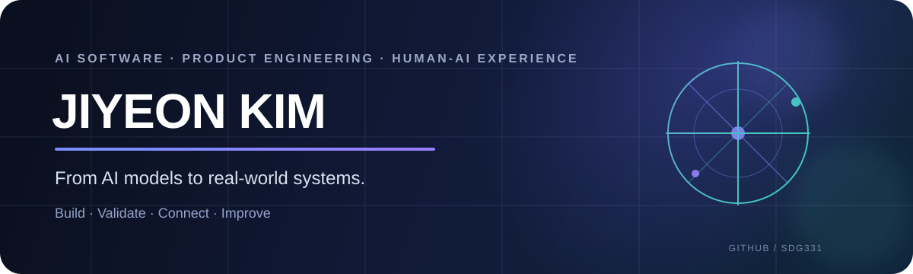

<div align="center">



<br/>

### AI를 모델에서 끝내지 않고, 사용자가 직접 경험하는 제품과 시스템까지 연결합니다.

`AI Software` · `Product Engineering` · `Web` · `Embedded` · `Human-AI Experience`

<br/>

<a href="#selected-work">Selected Work</a> ·
<a href="#toolkit">Toolkit</a> ·
<a href="#highlights">Highlights</a> ·
<a href="#currently">Currently</a>

</div>

---

## Hello, I'm Jiyeon.

동양미래대학교 **인공지능소프트웨어학과**에서 AI와 소프트웨어를 공부하고 있는 김지연입니다.

저는 하나의 기술만 구현하는 것보다, **문제를 정의하고 AI·소프트웨어·하드웨어·사용자 경험을 연결해 실제로 동작하는 결과물을 만드는 과정**에 관심이 있습니다.

특히 다음과 같은 문제를 좋아합니다.

- AI 모델이나 LLM을 **실제 서비스 흐름**에 연결하는 일
- Web · Backend · Data · Embedded를 묶어 **end-to-end 시스템**을 만드는 일
- Raspberry Pi, NFC, Camera, Sensor 같은 장치를 활용해 **화면 밖의 사용자 경험**을 설계하는 일
- 아이디어를 빠르게 프로토타입으로 만들고, 직접 테스트하며 개선하는 일

> **Problem → Prototype → Evaluate → Integrate → Improve**

---

# Selected Work

## 01. 4-Fit MirrorTing

### AI Smart Mirror for Workplace Communication Training

**직장생활에서 처음 마주칠 수 있는 대화 상황을 AI와 미리 경험하고, 자신의 커뮤니케이션을 점검하는 스마트미러 기반 시뮬레이션 시스템**

`Project Manager` `System Planning` `Hardware Lead`

**What I worked on**

- 음성 기반 직장 대화 시나리오와 사용자 체험 흐름 설계
- STT · LLM · Computer Vision을 연결하는 전체 시스템 구조 설계
- 표정 · 목소리 · 내용 · 상황을 결합한 **4-Fit 피드백 경험** 기획
- 65인치 스마트미러, Azure Kinect, NFC, Raspberry Pi 키오스크 등 하드웨어 통합
- Frontend · Backend · AI · Hardware 간 세션 및 데이터 흐름 정의
- EXPO 체험 동선, 관리자 대시보드, 프로젝트 웹사이트까지 하나의 서비스 경험으로 연결

**Repositories**

[EXPO Microsite](https://github.com/sdg331/CarpeDM_EXPO_Microsite) ·
[ID Printer Kiosk](https://github.com/sdg331/CarpeDM_EXPO_IDPrinter) ·
[Admin Dashboard](https://github.com/sdg331/CarpeDM_EXPO_dashboard)

`React` `TypeScript` `FastAPI` `LLM` `STT` `Computer Vision` `NFC` `Raspberry Pi`

---

## 02. Ginger

### AI Question Coach for Deeper Thinking

**정답을 바로 제공하기보다, 학습자의 답변을 분석하고 다음 사고 단계로 이어지는 질문을 제공하는 AI 학습 서비스**

- 한국어 서술형 답변을 TF-IDF 특징으로 변환
- `scikit-learn` 기반 분류 모델 구축
- 답변 특징을 Level 1–4 형태로 분석
- 낮은 예측 신뢰도에 대한 fallback 처리
- 추론 로직과 UI를 분리한 구조 설계
- pytest · Docker · GitHub Actions 기반 실행 및 검증 환경 구성

[Repository](https://github.com/sdg331/ginger-app)

`Python` `scikit-learn` `TF-IDF` `Streamlit` `pytest` `Docker` `GitHub Actions`

---

## 03. Neuro Drive

### Reinforcement Learning You Can Watch

**AI가 학습하고 실패하고 전략을 바꾸는 과정을 사용자가 직접 관찰할 수 있도록 만든 브라우저 기반 AI 리터러시 프로젝트**

외부 머신러닝 프레임워크 없이 JavaScript로 다음 요소를 직접 구현했습니다.

- Deep Q-Network
- Neural Network
- Forward / Backpropagation
- Experience Replay
- Target Network
- Reward-based Learning

또한 Learning Curve, Value Map, Neural Network State, Reward Hacking Experiment를 시각화해 **AI의 학습 과정을 결과가 아닌 과정으로 이해할 수 있도록** 설계했습니다.

[Live Demo](https://sdg331.github.io/neuro-drive/) · [Repository](https://github.com/sdg331/neuro-drive)

`JavaScript` `HTML` `CSS` `Canvas` `DQN` `PWA`

---

## 04. ReliefCheck

### Offline Relief Distribution Management System

**네트워크가 불안정한 재난 현장에서도 중복 지급을 방지하고 지급 기록을 관리할 수 있도록 설계한 Raspberry Pi 기반 시스템**

- 듀얼 NFC 입력 및 지급 정책 판정
- SQLite 기반 재고 및 감사 원장 관리
- 감열 프린터 · 카메라 · NFC 장치 통합
- 거래 상태와 출력 상태를 분리해 프린터 오류가 중복 거래로 이어지지 않도록 설계
- 하드웨어별 Adapter 구조와 단위 테스트 적용

[Repository](https://github.com/sdg331/CarpeDM_EswContest)

`Python` `SQLite` `Raspberry Pi` `NFC` `JavaScript` `pytest`

---

### More Experiments

**[헛똑똑이 랩](https://github.com/sdg331/heotlab)**  
Hallucination과 Reward Hacking을 짧은 실험으로 경험하는 AI 리터러시 웹 애플리케이션 · [Live Demo](https://sdg331.github.io/heotlab/)

**[AI Indie Game Hackathon](https://github.com/sdg331/AI_INDIGAME_HACKATHON)**  
Unity 기반 AI 인디게임 해커톤 프로젝트

---

# Toolkit

<div align="center">
  
</div>

<br/>

| Area | Working With |
| --- | --- |
| **AI · ML** | scikit-learn · TF-IDF · LLM Applications · STT · Computer Vision |
| **Data** | Pandas · NumPy · SQLite |
| **Frontend** | React · TypeScript · JavaScript · Vite · Streamlit |
| **Backend** | Python · FastAPI · REST API |
| **Embedded** | Raspberry Pi · NFC · Camera · Sensors · Touch Display |
| **Engineering** | Git · GitHub Actions · pytest · Docker |
| **Product** | System Planning · Rapid Prototyping · UI/UX · Hardware Integration |

---

# How I Build

```text
Define the problem
      ↓
Build the smallest working prototype
      ↓
Measure what actually works
      ↓
Connect AI with the product experience
      ↓
Test in the real environment
      ↓
Improve
```

저는 모델 정확도만 높이는 것보다 **사용자가 실제로 사용할 수 있는 전체 시스템을 완성하는 것**을 중요하게 생각합니다.

그래서 새로운 기술을 배울 때도 가능한 한 작은 실험으로 직접 구현하고, 결과를 확인한 뒤 다음 단계로 확장합니다.

---

# Currently

**Building**
- 4-Fit MirrorTing — AI 기반 스마트미러 직장생활 시뮬레이션 시스템
- AI · Web · Embedded가 연결되는 실제 체험형 프로덕트

**Deepening**
- Machine Learning fundamentals
- Deep Learning
- Natural Language Processing
- Computer Vision
- LLM application architecture
- Model evaluation
- AI deployment & MLOps

**Exploring**
- AI × Product Design
- AI × Education
- AI × Physical Computing
- AI를 활용한 빠른 실험과 서비스 검증

---

# Highlights

### Awards

| Year | Award | Program · Competition |
| --- | --- | --- |
| 2026 | 우수상 | 학생참여형 리빙랩 활동 지원 프로그램 |
| 2026 | 우수상 | 태일씨앤티 웹사이트 리뉴얼 경진대회 |
| 2025 | 동상 | 한국실천공학회 교육장비개발대회 |
| 2025 | 동상 | AI로 만드는 우리 대학 이야기 공모전 |

### Activities

`2026 동양미래대학교 EXPO 본선` ·
`실전창업멘토링 및 IP 권리화 프로그램 본선(심화 멘토링 진행중)` ·
`도전! 메가시티 리그전 본선` ·
`D.StartupZone 입주 학생` ·
`AI Indie Game Hackathon`

---

<div align="center">

### Build AI that works beyond the demo.

**Learn · Build · Evaluate · Connect · Improve**

<br/>

[](https://github.com/sdg331)

</div>
